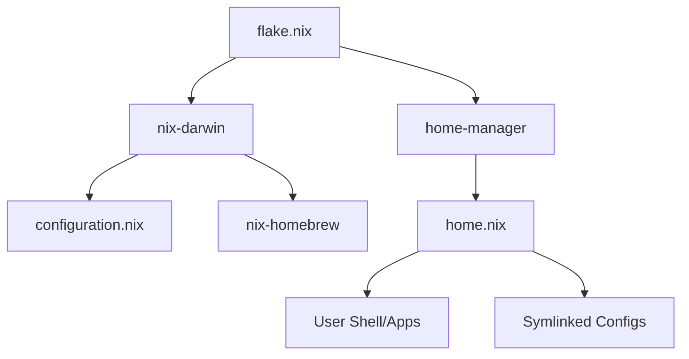

# Architecture Overview

This document explains the structural design and decision-making behind the dotfiles configuration.

## 🗺️ High-Level Flow

The configuration is structured as a tree, where `flake.nix` acts as the root orchestrator.

## 🧩 Component Breakdown

### 1. The Flake (`flake.nix`)
The Flake is the entry point. Its primary roles are:
- **Dependency Pinning**: It defines the inputs (`nixpkgs`, `nix-darwin`, `home-manager`) as named branches. The exact commits are pinned in `flake.lock`, which ensures that if you clone this repo on another machine a year from now, you get the exact same environment.
- **System Definition**: It defines the `darwinConfigurations.mac`, which tells Nix that this set of modules applies to a machine named "mac".

### 2. System Configuration (`configuration.nix`)
This file manages the "global" state of the macOS machine:
- **macOS Defaults**: Uses `system.defaults` to modify system-level preferences (e.g., Dock, Finder, UI appearance).
- **Homebrew Integration**: Manages Homebrew through `nix-homebrew`. This is used for software that is not available in Nix or is significantly easier to maintain via Brew (e.g., proprietary GUI apps).
- **Privileged Settings**: Anything requiring `sudo` or system-level permissions is handled here.

### 3. User Configuration (`home.nix`)
Managed by **Home Manager**, this file handles the user-space environment:
- **Package Management**: Defines CLI tools that are installed specifically for the user.
- **Shell Configuration**: Declaratively configures Zsh and the Starship prompt.
- **Environment Variables**: Sets `EDITOR` and other session variables.

## 🔗 Configuration Strategies

### Declarative vs. Imperative
- **Declarative**: Settings defined in `.nix` files. To change a setting, you edit the code and rebuild. This provides a "single source of truth".
- **Symlinked**: Files in `home/.config/` are not managed by Nix's internal store. Instead, they are linked from the repo to the filesystem.

### The `mkOutOfStoreSymlink` Choice
Standard Home Manager files are copied into the `/nix/store` (which is read-only). If you edit a file in `~/.config/nvim` that was managed normally, the changes are lost on the next rebuild.

By using `config.lib.file.mkOutOfStoreSymlink`, we create a link directly to the file in your GitHub repository.
- **Benefit**: You can use your editor to modify `~/.config/nvim/init.lua`, save it, and the change is immediate and persistent.
- **Benefit**: You can commit those changes to Git without having to run `rebuild.sh`.

## 📂 The `.dotfiles` Symlink

The `rebuild.sh` script ensures that `~/.dotfiles` points to your repository. This creates a consistent path that `home.nix` can rely on when creating the "Out of Store" symlinks mentioned above, regardless of where you actually cloned the repository on your disk.
